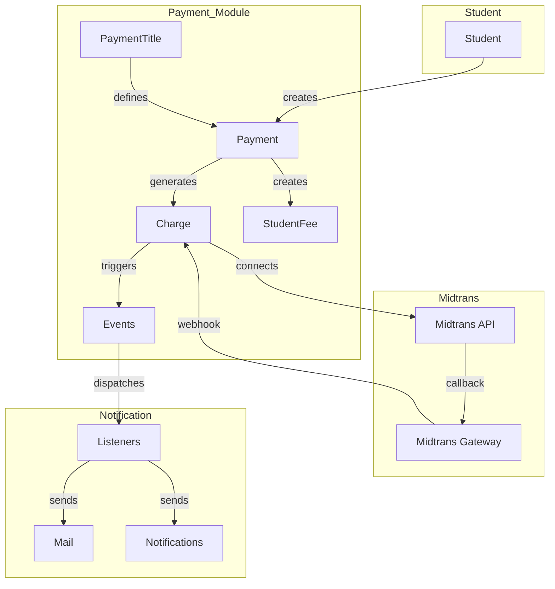
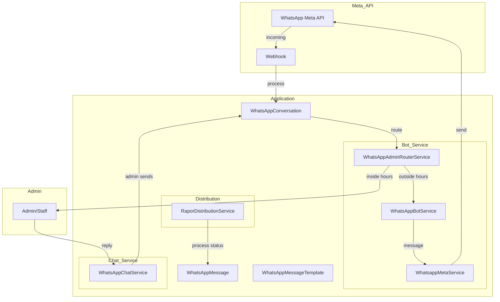
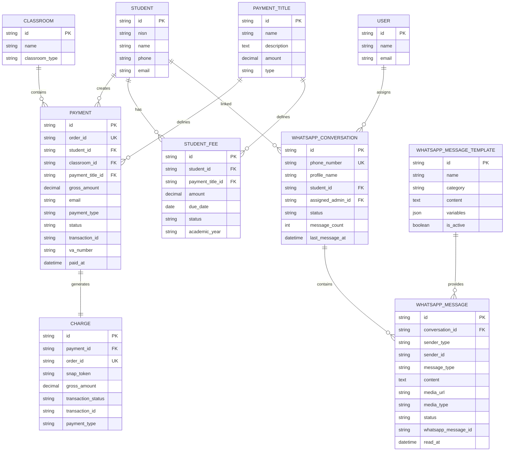

# ERD Documentation: Payment & WhatsApp Gateway

## 1. Payment System Flow Chart (Mermaid)



## 2. Payment System ERD (Chen Notation)

### Entities & Attributes

| Entity | Primary Key | Attributes |
|--------|-------------|------------|
| **PaymentTitle** | `id` | name, description, amount, type, academic_year_id |
| **Payment** | `id` | order_id, student_id, classroom_id, payment_title_id, gross_amount, email, payment_type, status, transaction_id, va_number, paid_at |
| **Charge** | `id` | payment_id, order_id, snap_token, gross_amount, transaction_status, transaction_id, payment_type |
| **StudentFee** | `id` | student_id, payment_title_id, amount, due_date, status, academic_year, notes |
| **Student** | `id` | nisn, name, phone, email, classroom_id |

### Relationships (Chen Notation)

```
Student (1,N) ──────< Payment >─────── (1,1) Classroom
Payment (1,N) ──────< PaymentTitle
Payment (1,1) ──────< Charge
Student (1,N) ──────< StudentFee
StudentFee (0,N) ───< PaymentTitle
```

### Cardinality Summary

| From | Relationship | To | Type |
|------|--------------|-----|------|
| Student | has many | Payment | 1:N |
| Student | has many | StudentFee | 1:N |
| Student | has many | WhatsAppConversation | 1:N |
| PaymentTitle | defines many | Payment | 1:N |
| PaymentTitle | defines many | StudentFee | 1:N |
| Payment | generates | Charge | 1:1 |
| Payment | belongs to | Classroom | N:1 |
| WhatsAppConversation | belongs to | Student | N:1 |
| WhatsAppConversation | has many | WhatsAppMessage | 1:N |

---

## 3. WhatsApp Gateway Flow Chart (Mermaid)



## 4. WhatsApp Gateway ERD (Chen Notation)

### Entities & Attributes

| Entity | Primary Key | Attributes |
|--------|-------------|------------|
| **WhatsAppConversation** | `id` | phone_number, profile_name, student_id, assigned_admin_id, status, message_count, last_message_at |
| **WhatsAppMessage** | `id` | conversation_id, sender_type, sender_id, message_type, content, media_url, media_type, status, whatsapp_message_id, read_at |
| **WhatsAppMessageTemplate** | `id` | name, category, content, variables, is_active |
| **Student** | `id` | nisn, name, phone |
| **User** | `id` | name, email (admin) |

### Relationships (Chen Notation)

```
WhatsAppConversation (1,1) ──────< Student
WhatsAppConversation (0,1) ──────< User (Admin)
WhatsAppConversation (1,N) ──────< WhatsAppMessage
WhatsAppMessageTemplate (1,N) ──────< WhatsAppMessage
```

### System States (Bot)

| State | Description |
|-------|-------------|
| `new` | User never chatted |
| `menu` | Greeted, waiting for choice |
| `waiting_nisn` | Waiting for NISN input |
| `verified` | NISN verified successfully |

---

## 5. Complete Unified ERD (Mermaid)



---

## 6. Chen Notation Summary

### Payment Domain

```
                        ┌─────────────────┐
                        │   PaymentTitle  │
                        │─────────────────│
                        │ id (PK)         │
                        │ name            │
                        │ amount          │
                        │ type            │
                        └────────┬────────┘
                                 │ 1:N
                                 │
        ┌────────────────────────┼────────────────────────┐
        │                        │                        │
        ▼                        ▼                        ▼
┌───────────────┐      ┌───────────────┐      ┌───────────────┐
│    Student    │      │    Payment    │      │  StudentFee   │
│───────────────│      │───────────────│      │───────────────│
│ id (PK)       │◄─────│ student_id FK │      │ student_id FK │
│ nisn          │ 1:N  │ payment_title │──────│ payment_title │
│ name          │      │ gross_amount  │ 1:N  │ amount        │
│ phone         │      │ status        │      │ due_date      │
└───────────────┘      │ paid_at       │      │ status        │
                       └───────┬───────┘      └───────────────┘
                               │
                               │ 1:1
                               ▼
                       ┌───────────────┐
                       │    Charge     │
                       │───────────────│
                       │ id (PK)       │
                       │ order_id      │
                       │ snap_token    │
                       │ transaction_  │
                       │   status      │
                       └───────────────┘
```

### WhatsApp Domain

```
┌─────────────────────┐       ┌─────────────────────┐
│       Student       │       │        User         │
│─────────────────────│       │─────────────────────│
│ id (PK)            │       │ id (PK)            │
│ nisn               │       │ name               │
│ name               │       │ email              │
│ phone              │       └─────────┬───────────┘
└────────┬────────────┘                 │
         │ 1:N                           │ 1:N (assigned)
         ▼                               ▼
┌─────────────────────┐       ┌─────────────────────┐
│ WhatsAppConversation│       │ WhatsAppConversation│
│─────────────────────│       │─────────────────────│
│ id (PK)            │       │ id (PK)             │
│ phone_number       │       │ phone_number        │
│ profile_name       │       │ assigned_admin_id   │
│ student_id (FK)    │       │ status              │
│ status             │       └──────────┬──────────┘
└────────┬────────────┘                  │
         │ 1:N                           │
         ▼                               │
┌─────────────────────┐       ┌─────────────────────┐
│  WhatsAppMessage    │       │ WhatsAppMessage     │
│─────────────────────│       │─────────────────────│
│ id (PK)            │       │ id (PK)             │
│ conversation_id    │       │ conversation_id     │
│ sender_type        │       │ sender_type         │
│ content            │       │ content             │
│ status             │       │ status              │
└─────────────────────┘       └─────────────────────┘

┌─────────────────────┐
│ WhatsAppMessage    │
│ Template            │
│─────────────────────│
│ id (PK)            │
│ name               │
│ category           │
│ content            │
│ is_active          │
└─────────────────────┘
```

---

## 7. Status Values Reference

### Payment Status
| Status | Description |
|--------|-------------|
| `pending` | Waiting for payment |
| `partial` | Partial payment received |
| `completed` | Full payment received ✓ |
| `overdue` | Payment overdue |
| `failed` | Payment failed |
| `cancelled` | Payment cancelled |

### WhatsApp Conversation Status
| Status | Description |
|--------|-------------|
| `active` | Conversation active |
| `closed` | Conversation closed |
| `archived` | Conversation archived |

### WhatsApp Message Status
| Status | Description |
|--------|-------------|
| `sent` | Message sent to API |
| `delivered` | Delivered to user |
| `read` | Read by user |
| `failed` | Failed to send |
| `pending` | Waiting to send |