# ProductSchool - System Flow Documentation

> Dokumentasi lengkap alur sistem ProductSchool
> Generated: 2026-05-14
> Laravel ^12.56 · PHP ^8.2

---

## 📋 Daftar Isi

1. [Arsitektur Sistem](#arsitektur-sistem)
2. [Flow Utama](#flow-utama)
3. [Flow per Modul](#flow-per-modul)
4. [Integrasi Sistem](#integrasi-sistem)
5. [Security & Authorization](#security--authorization)

---

## 🏗️ Arsitektur Sistem

### Layer Architecture
```
┌─────────────────────────────────────────────────────────┐
│                    PRESENTATION LAYER                    │
│  Routes → Middleware → Controllers → Views (Blade)       │
└─────────────────────────────────────────────────────────┘
                            ↓
┌─────────────────────────────────────────────────────────┐
│                    BUSINESS LOGIC LAYER                  │
│  Services → Actions → Events → Jobs → Listeners         │
└─────────────────────────────────────────────────────────┘
                            ↓
┌─────────────────────────────────────────────────────────┐
│                    DATA ACCESS LAYER                     │
│  Models → Repositories → Database (MySQL/PostgreSQL)     │
└─────────────────────────────────────────────────────────┘
                            ↓
┌─────────────────────────────────────────────────────────┐
│                    EXTERNAL SERVICES                     │
│  WhatsApp API · Midtrans · Sentry · Storage (S3/Local)  │
└─────────────────────────────────────────────────────────┘
```

### Tech Stack
- **Backend:** PHP ^8.2, Laravel ^12.56
- **Frontend:** Vite, Tailwind CSS, Alpine.js
- **Database:** MySQL/PostgreSQL
- **Queue:** Redis/Database
- **Storage:** Local/S3
- **Real-time:** Laravel Reverb (WebSocket)
- **Payment:** Midtrans
- **Monitoring:** Sentry

---

## 🔄 Flow Utama

### 1. Authentication Flow

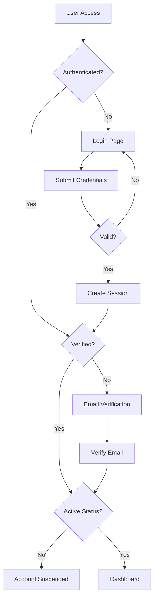

**Endpoints:**
- `GET /login` - Tampilkan form login
- `POST /login` - Proses login
- `GET /register` - Form registrasi
- `POST /register` - Proses registrasi
- `GET /verify-email` - Halaman verifikasi email
- `POST /logout` - Logout user

**Middleware:**
- `auth` - Cek autentikasi
- `verified` - Cek email terverifikasi
- `CheckUserStatus` - Cek status aktif user

---

### 2. Authorization Flow

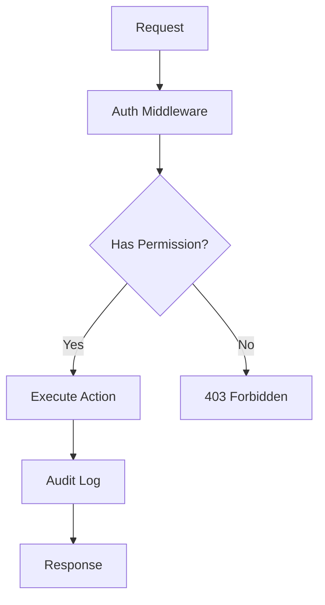

**Permission System:**
- Menggunakan `spatie/laravel-permission`
- Role-based access control (RBAC)
- Permission format: `action` atau `resource`
- Contoh: `view-students`, `create-students`, `dashboard.students.index`

---

## 📚 Flow per Modul

### 1. Student Management Flow

#### A. Student Registration (Admission)

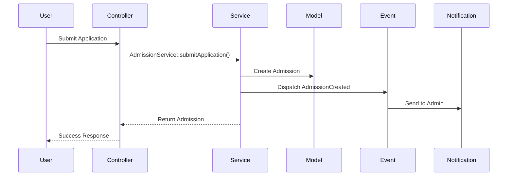

**Flow Detail:**
1. **Create Application** (`POST /dashboard/admissions`)
   - User mengisi form pendaftaran
   - Data disimpan dengan status `draft`
   - Event `AdmissionCreated` di-dispatch

2. **Submit Application** (`POST /dashboard/admission/{id}/review`)
   - Status berubah ke `submitted`
   - Event `AdmissionSubmitted` di-dispatch
   - Notifikasi ke admin

3. **Review Process** (`POST /dashboard/admission/{id}/approve|reject`)
   - Admin review aplikasi
   - Approve: status → `approved`, Event `AdmissionApproved`
   - Reject: status → `rejected`, Event `AdmissionRejected`

4. **Enrollment** (`POST /dashboard/admission/{id}/enroll`)
   - Create Student record
   - Assign to classroom (optional)
   - Create user account
   - Event `AdmissionEnrolled`
   - Status → `enrolled`

**Services:**
- `AdmissionService::submitApplication()`
- `AdmissionService::enrollStudent()`
- `AdmissionService::exportApprovedAsCSV()`

**Events:**
- `AdmissionCreated`
- `AdmissionSubmitted`
- `AdmissionApproved`
- `AdmissionRejected`
- `AdmissionEnrolled`

---

#### B. Student Import Flow

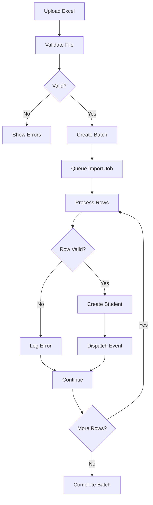

**Endpoints:**
- `POST /dashboard/students/import` - Upload file
- `GET /dashboard/students/import/progress/{batchId}` - Check progress
- `GET /dashboard/students/import/template/download` - Download template

**Process:**
1. Upload file Excel (.xlsx)
2. Validasi struktur file
3. Create import batch
4. Queue job untuk process per row
5. Real-time progress via WebSocket
6. Event `StudentImportProgress` untuk update UI

**Jobs:**
- `ProcessStudentImport` - Process batch
- `ProcessStudentRow` - Process single row

---

#### C. Student CRUD Flow

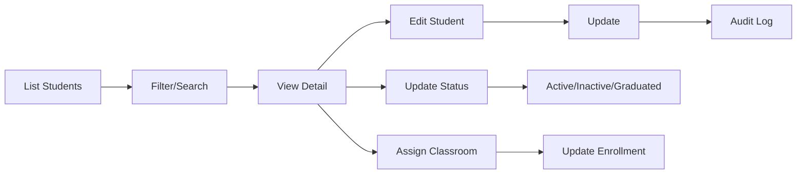

**Endpoints:**
- `GET /dashboard/students` - List students
- `GET /dashboard/students/create` - Form create
- `POST /dashboard/students` - Store student
- `GET /dashboard/students/{id}` - Show detail
- `GET /dashboard/students/{id}/edit` - Form edit
- `PUT /dashboard/students/{id}` - Update student
- `DELETE /dashboard/students/{id}` - Delete student
- `POST /dashboard/students/{id}/status` - Update status
- `POST /dashboard/students/{id}/assign-class` - Assign classroom
- `POST /dashboard/students/{id}/unassign-class` - Unassign classroom

---

### 2. Attendance Management Flow

#### A. Student Attendance

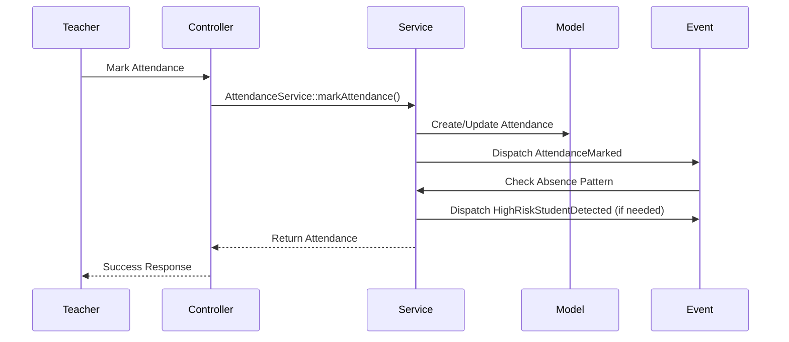

**Flow:**
1. Teacher pilih kelas dan tanggal
2. Tampilkan daftar siswa
3. Mark attendance (Present, Absent, Late, Sick, Permission)
4. Save attendance records
5. Event `StudentAttendanceMarked` di-dispatch
6. Cek pattern ketidakhadiran
7. Jika high-risk, dispatch `HighRiskStudentDetected`

**Endpoints:**
- `GET /dashboard/attendances` - List attendance
- `POST /dashboard/attendances` - Mark attendance
- `GET /dashboard/attendances/daily/{id}` - Daily report
- `GET /dashboard/attendances/monthly/{id}` - Monthly report

---

#### B. Employee Attendance (Check-in/Check-out)

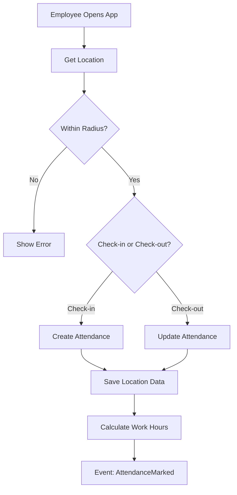

**Features:**
- GPS-based check-in/check-out
- KML file untuk define area sekolah
- Validasi lokasi dengan radius
- Foto selfie saat check-in/check-out
- Calculate work hours
- Late detection
- Overtime calculation

**Endpoints:**
- `GET /dashboard/my-attendance` - My attendance page
- `POST /dashboard/employee-attendances/check-in` - Check-in
- `POST /dashboard/employee-attendances/check-out` - Check-out
- `GET /dashboard/employee-attendances/today` - Today's attendance
- `GET /dashboard/employee-attendances/monthly-report/{employeeId}` - Monthly report

**Services:**
- `EmployeeAttendanceService::checkIn()`
- `EmployeeAttendanceService::checkOut()`
- `KmlService::parseKml()` - Parse KML file
- `KmlService::isLocationWithinBounds()` - Validate location

---

### 3. Grade Management Flow

#### A. Grade Entry Flow

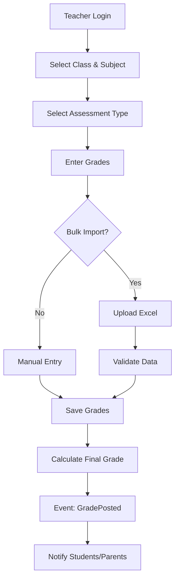

**Grade Components:**
- Pengetahuan (Knowledge)
- Keterampilan (Skills)
- Sikap (Attitude)
- Custom components per subject

**Endpoints:**
- `GET /dashboard/grades` - List grades
- `POST /dashboard/grades` - Store grade
- `GET /dashboard/grades/bulk-import` - Bulk import page
- `POST /dashboard/grades/bulk-import` - Process bulk import
- `GET /dashboard/grades/template/download` - Download template
- `GET /dashboard/grades/components` - View components
- `GET /dashboard/grades/transcript/{student}` - Student transcript

**Weight Configuration:**
- `GET /dashboard/grade/student/weights` - Weight config page
- `POST /dashboard/grade/student/weights/store` - Save weights
- `POST /dashboard/grade/student/weights/copy` - Copy weights to other classes

---

#### B. Grade Calculation Flow

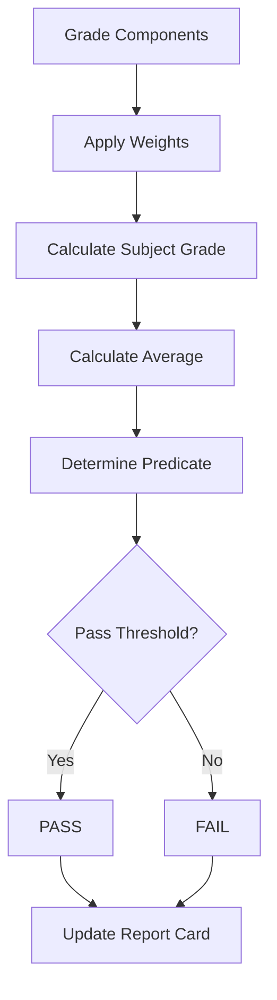

**Formula:**
```
Final Grade = (Knowledge × Weight_K) + (Skills × Weight_S) + (Attitude × Weight_A)

Predicate:
- A: 90-100
- B: 80-89
- C: 70-79
- D: 60-69
- E: 0-59
```

**Services:**
- `GradeCalculationService::calculateFinalGrade()`
- `FormulaEvaluatorService::evaluate()` - Custom formula evaluation

---

### 4. Report Card (Rapor) Flow

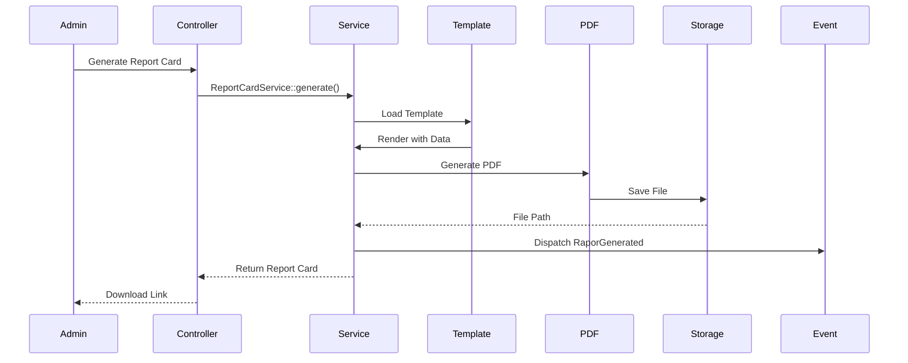

**Flow:**
1. **Template Selection**
   - Admin pilih template rapor
   - Template menggunakan Fabric.js untuk design
   - Support variables: `{{student.name}}`, `{{grade.math}}`, dll

2. **Data Collection**
   - Collect all grades
   - Calculate averages
   - Get attendance summary
   - Get P5 assessment (Projek Penguatan Profil Pelajar Pancasila)
   - Get teacher notes (narasi)

3. **PDF Generation**
   - Render template dengan data
   - Convert to PDF using DomPDF
   - Save to storage

4. **Distribution**
   - Manual download
   - WhatsApp distribution (bulk)
   - Email distribution

**Endpoints:**
- `POST /dashboard/report-cards/generate` - Generate single
- `POST /dashboard/report-cards/generate-multiple` - Generate bulk
- `GET /dashboard/report-cards/{id}/preview` - Preview
- `GET /dashboard/report-cards/{id}/download` - Download
- `POST /dashboard/report-cards/{id}/finalize` - Finalize (lock)

**Services:**
- `ReportCardService::generate()`
- `TemplateGeneratorService::generatePdf()`
- `RaporDistributionService::distribute()`

---

### 5. Payment Management Flow

#### A. Payment Creation Flow

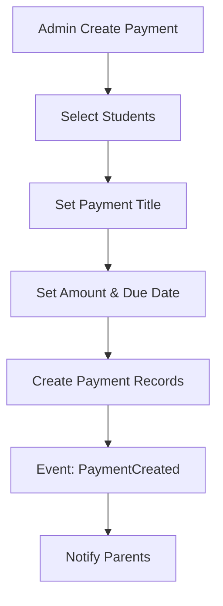

**Payment Types:**
- SPP (Monthly tuition)
- Registration fee
- Exam fee
- Activity fee
- Custom payments

**Endpoints:**
- `GET /dashboard/payments` - List payments
- `POST /dashboard/payments` - Create payment
- `GET /dashboard/payments/outstanding/{studentId}` - Outstanding payments
- `POST /dashboard/payments/{id}/mark-paid` - Mark as paid (manual)

---

#### B. Midtrans Integration Flow

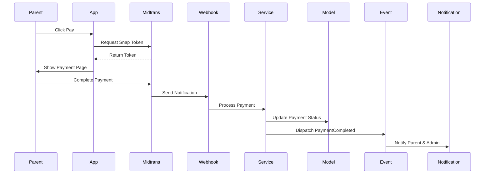

**Endpoints:**
- `POST /dashboard/midtrans/snap-token/{paymentId}` - Get snap token
- `GET /dashboard/midtrans/status/{chargeId}` - Check status
- `POST /dashboard/midtrans/refund/{paymentId}` - Refund
- `POST /dashboard/midtrans/cancel/{paymentId}` - Cancel

**Webhook:**
- `POST /api/midtrans/notification` - Midtrans webhook

**Services:**
- `MidtransService::createTransaction()`
- `MidtransService::processCallback()`
- `PaymentService::updateStatus()`

---

### 6. Payroll Management Flow

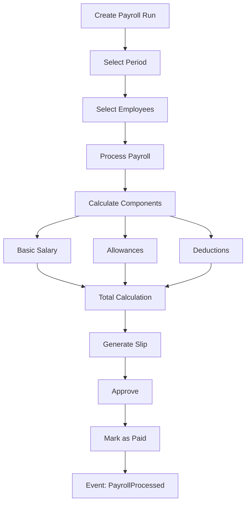

**Salary Components:**
1. **Basic Salary** - Based on salary grade
2. **Allowances:**
   - Education allowance
   - Structural allowance (position)
   - Functional allowance (certification)
   - Transport allowance
   - Meal allowance
3. **Deductions:**
   - Tax (PPh 21)
   - Insurance (BPJS)
   - Loan repayment
   - Late penalty

**Endpoints:**
- `GET /dashboard/payrolls` - List payroll runs
- `POST /dashboard/payrolls/store` - Create payroll run
- `POST /dashboard/payrolls/{id}/process` - Process payroll
- `GET /dashboard/payrolls/{id}/report` - Generate report
- `POST /dashboard/payrolls/{id}/mark-paid` - Mark as paid
- `GET /dashboard/payrolls/slip/{id}` - Generate slip
- `GET /dashboard/payrolls/{id}/export-zip` - Export all slips

**Services:**
- `PayrollService::processPayrollRunWithProgress()`
- `PayrollService::calculateSalary()`
- `PayrollExportService::exportPayrollRunToZip()`

---

### 7. Template Management Flow

#### A. Template Creation Flow

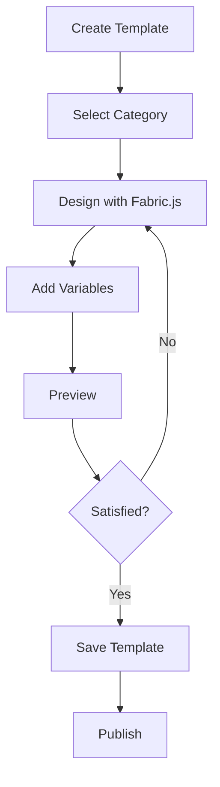

**Template Types:**
- Report Card (Rapor)
- Certificate
- Letter
- ID Card
- Custom documents

**Variables Available:**
- Student data: `{{student.name}}`, `{{student.nisn}}`, dll
- Grade data: `{{grade.math}}`, `{{grade.average}}`, dll
- School data: `{{school.name}}`, `{{school.address}}`, dll
- Date: `{{date.now}}`, `{{date.semester}}`, dll

**Endpoints:**
- `GET /dashboard/templates` - List templates
- `POST /dashboard/templates` - Create template
- `GET /dashboard/templates/{id}/preview` - Preview
- `GET /dashboard/templates/variables` - Get available variables

**Services:**
- `TemplateGeneratorService::createInstance()`
- `TemplateGeneratorService::generatePdf()`
- `VariableResolver::resolve()` - Resolve variables

---

#### B. Template Instance Flow

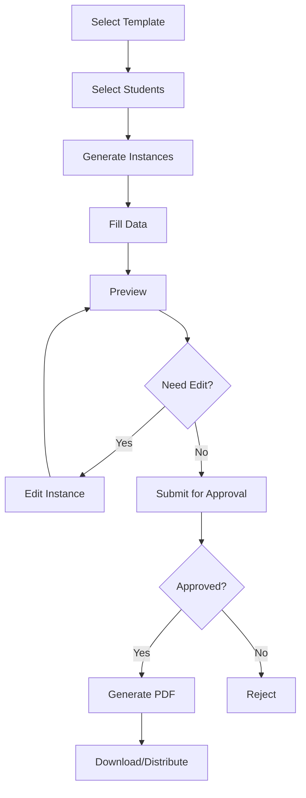

**Endpoints:**
- `GET /dashboard/template-instances` - List instances
- `POST /dashboard/template-instances` - Create instance
- `GET /dashboard/template-instances/{id}/preview` - Preview
- `GET /dashboard/template-instances/{id}/pdf` - Generate PDF
- `POST /dashboard/template-instances/{id}/submit` - Submit for approval
- `POST /dashboard/template-instances/{id}/approve` - Approve
- `POST /dashboard/template-instances/bulk/generate` - Bulk generate

---

### 8. WhatsApp Integration Flow

#### A. WhatsApp Bot Flow

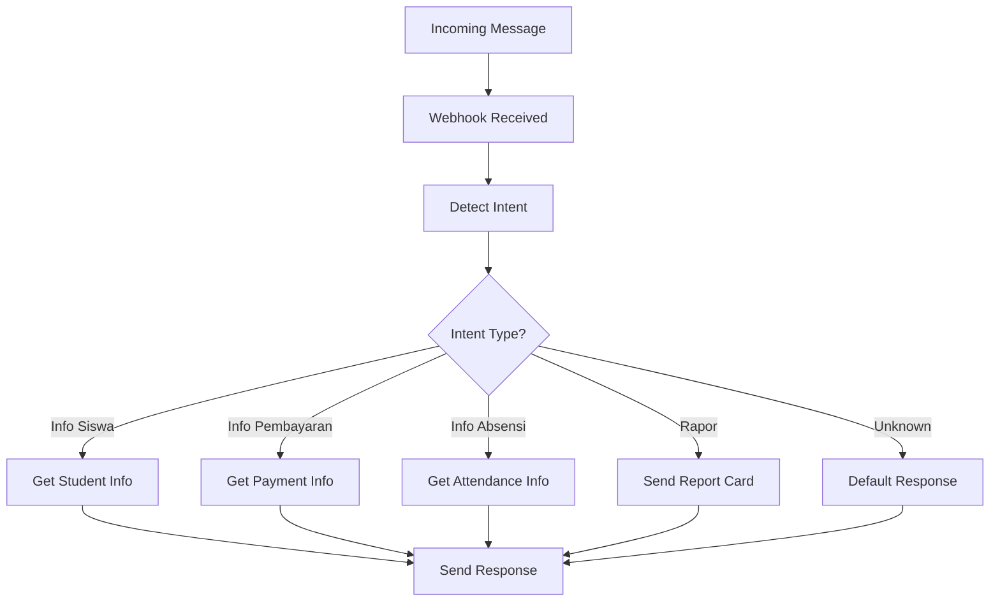

**Bot Commands:**
- `info siswa [NISN]` - Get student info
- `pembayaran [NISN]` - Get payment status
- `absensi [NISN]` - Get attendance summary
- `rapor [NISN]` - Request report card
- `help` - Show help

**Endpoints:**
- `POST /api/whatsapp/webhook` - WhatsApp webhook
- `GET /dashboard/whatsapp-chat` - Chat management
- `POST /dashboard/whatsapp-chat/send` - Send message

**Services:**
- `WhatsAppBotService::handle()` - Handle incoming message
- `WhatsAppBotService::detectIntent()` - Detect user intent
- `WhatsappMetaService::sendMessage()` - Send message via Meta API

---

#### B. Rapor Distribution via WhatsApp

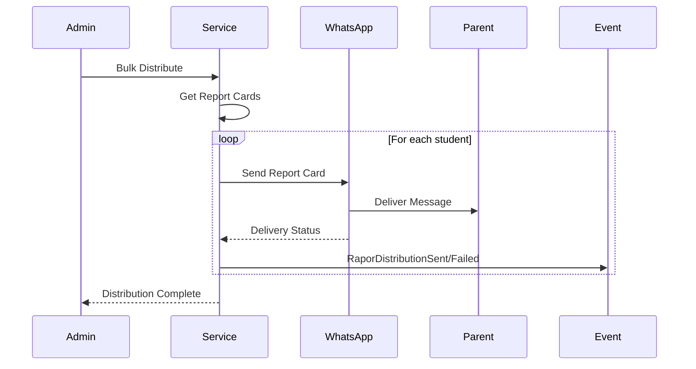

**Endpoints:**
- `POST /dashboard/rapor-distribution/store` - Start distribution
- `GET /dashboard/rapor-distribution` - Distribution history

**Services:**
- `RaporDistributionService::bulkDistributeClassroom()`
- `RaporDistributionService::handleWhatsAppWebhook()`

---

### 9. Early Warning System Flow

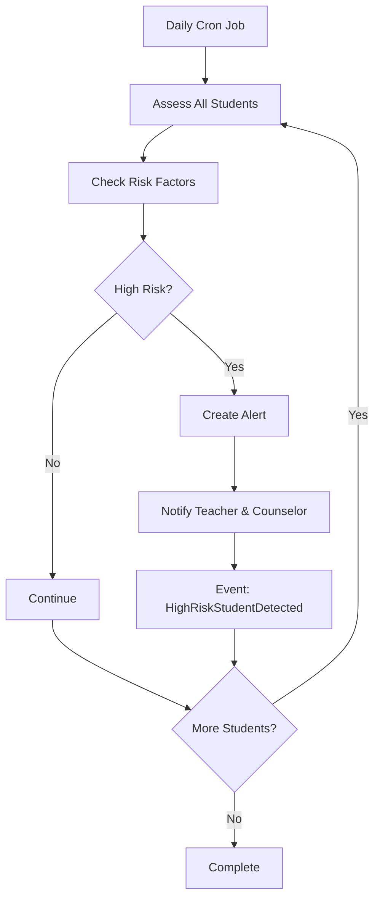

**Risk Factors:**
1. **Attendance** - Absent > 3 days in a week
2. **Grades** - Average < 60
3. **Behavior** - Multiple violations
4. **Payment** - Overdue > 30 days

**Risk Levels:**
- Low (1-2 factors)
- Medium (3-4 factors)
- High (5+ factors)

**Endpoints:**
- `GET /dashboard/early-warning` - List alerts
- `GET /dashboard/early-warning/{id}` - Alert detail
- `POST /dashboard/early-warning/{id}/resolve` - Mark as resolved

**Services:**
- `EarlyWarningService::assessStudent()`
- `EarlyWarningService::identifyRiskFactors()`
- `EarlyWarningService::generateRecommendations()`

---

### 10. Student Analytics Flow

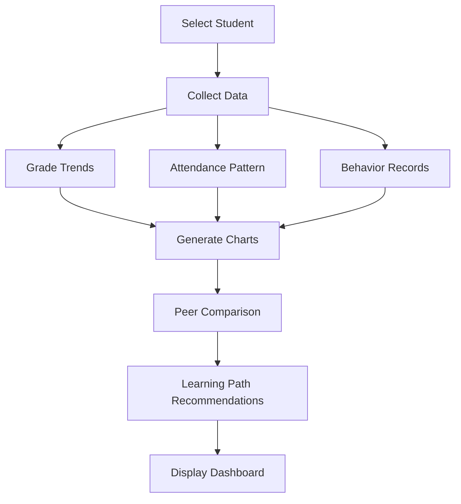

**Analytics Features:**
- Grade trends over time
- Subject performance comparison
- Attendance patterns
- Peer benchmarking
- Learning path recommendations
- Predictive analytics

**Endpoints:**
- `GET /dashboard/analytics` - Analytics dashboard
- `GET /dashboard/analytics/student/{id}/progress` - Student progress
- `GET /dashboard/analytics/class/{id}/comparison` - Class comparison
- `GET /dashboard/analytics/export` - Export analytics

**Services:**
- `StudentAnalyticsService::getDashboardSummary()`
- `StudentAnalyticsService::getPeerBenchmarkOptimized()`
- `StudentAnalyticsService::generateLearningPathRecommendations()`

---

## 🔗 Integrasi Sistem

### 1. Event-Driven Architecture

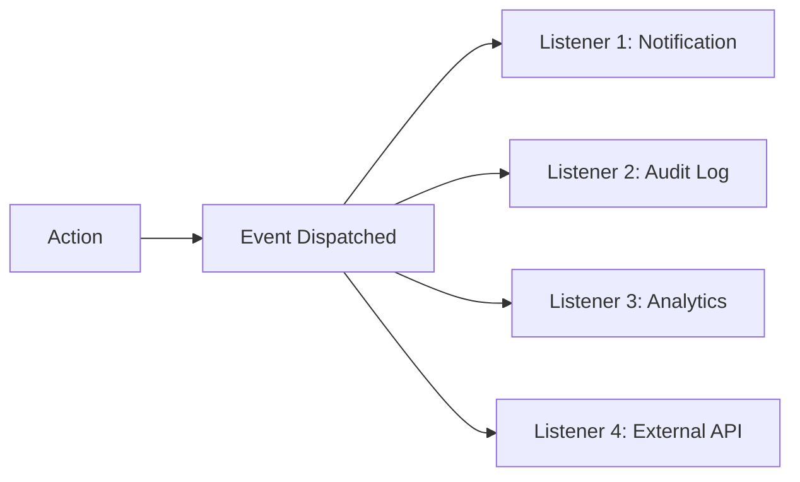

**Key Events:**
- `StudentCreated` → Send welcome email, create user account
- `AdmissionApproved` → Notify parent, prepare enrollment
- `GradePosted` → Notify student/parent, update analytics
- `PaymentCompleted` → Update balance, send receipt
- `AttendanceMarked` → Check patterns, trigger alerts
- `RaporGenerated` → Notify parent, log activity

---

### 2. Queue System

```mermaid
graph TD
    A[Heavy Task] --> B[Dispatch to Queue]
    B --> C[Redis/Database Queue]
    C --> D[Queue Worker]
    D --> E[Process Job]
    E --> F{Success?}
    F -->|Yes| G[Complete]
    F -->|No| H[Retry]
    H --> I{Max Retries?}
    I -->|No| E
    I -->|Yes| J[Failed]
```

**Queued Jobs:**
- Student import (bulk)
- Report card generation (bulk)
- Email sending (bulk)
- WhatsApp distribution
- Payroll processing
- File exports

---

### 3. Real-time Updates (WebSocket)

```mermaid
graph LR
    A[Server Event] --> B[Laravel Reverb]
    B --> C[WebSocket]
    C --> D[Client Browser]
    D --> E[Update UI]
```

**Real-time Features:**
- Import progress
- Notification updates
- Chat messages
- Dashboard stats

---

## 🔒 Security & Authorization

### 1. Permission Matrix

| Role | Students | Grades | Payments | Payroll | Settings |
|------|----------|--------|----------|---------|----------|
| Superadmin | ✅ All | ✅ All | ✅ All | ✅ All | ✅ All |
| Admin | ✅ All | ✅ View | ✅ All | ❌ | ✅ Limited |
| Teacher | ✅ View | ✅ Own Classes | ❌ | ❌ | ❌ |
| Parent | ✅ Own Child | ✅ Own Child | ✅ Own Child | ❌ | ❌ |
| Student | ✅ Self | ✅ Self | ✅ Self | ❌ | ❌ |

### 2. Audit Log

Semua action penting dicatat:
- Who (user)
- What (action)
- When (timestamp)
- Where (IP address)
- Changes (old & new values)

**Endpoint:**
- `GET /dashboard/audit-log` - View audit logs

---

## 📊 Performance Optimization

### 1. N+1 Query Prevention
- Eager loading dengan `with()`
- Lazy eager loading dengan `load()`
- Query optimization

### 2. Caching Strategy
- Config cache
- Route cache
- View cache
- Query result cache (Redis)

### 3. Database Indexing
- Primary keys
- Foreign keys
- Frequently queried columns
- Composite indexes

---

## 🚀 Deployment Flow

```mermaid
graph TD
    A[Git Push] --> B[CI/CD Pipeline]
    B --> C[Run Tests]
    C --> D{Tests Pass?}
    D -->|No| E[Notify Developer]
    D -->|Yes| F[Build Assets]
    F --> G[Deploy to Staging]
    G --> H[Run Migrations]
    H --> I[Smoke Tests]
    I --> J{OK?}
    J -->|No| K[Rollback]
    J -->|Yes| L[Deploy to Production]
    L --> M[Clear Cache]
    M --> N[Restart Queue Workers]
    N --> O[Monitor]
```

---

## 📝 Notes

### Code Smells yang Perlu Diperbaiki
- ⚠️ N+1 Query di 36 methods (lihat AGENTS.md)
- 🧱 Fat Methods di 200+ methods
- 🏗️ Fat Classes di 13 controllers

### Recommended Improvements
1. Refactor fat controllers → Extract to services
2. Fix N+1 queries → Add eager loading
3. Add more unit tests
4. Implement caching strategy
5. Add API documentation (OpenAPI/Swagger)

---

**Generated by:** Laravel Brain
**Last Updated:** 2026-05-14
**Version:** 1.0.0
